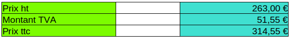

+++
title = "Tableurs"
date = 2024-09-13T22:52:58+02:00
draft = false 
+++

# Compte-rendu d'AP : Les Tableurs

## Objectifs

- ­Se familiariser avec l’utilisation des tableurs.
- Découvrir/revoir des commandes de base d’utilisation des tableurs.
- S’habituer a des situations réelles d’utilisation des tableurs en entreprise.

# Exercice 1 :

## 2.1 Les requêtes monotables

Le prix de vente d'un article est de 263€ ht
Le taux de TVA est de 19,6%


Pour calculer le montant de la TVA a 19,6 % nous effectuons la commande suivante ; 
```
= D6 * 0,196
= prix HT * 0,196
```

Puis pour calculer le prix TTC nous additionnons les deux valeurs ;
```
=D6 +D7
= prix HT + montant TVA
```

Le prix de vente d'un article est de 143,5€ ttc
Le taux de TVA est de 19,6%




